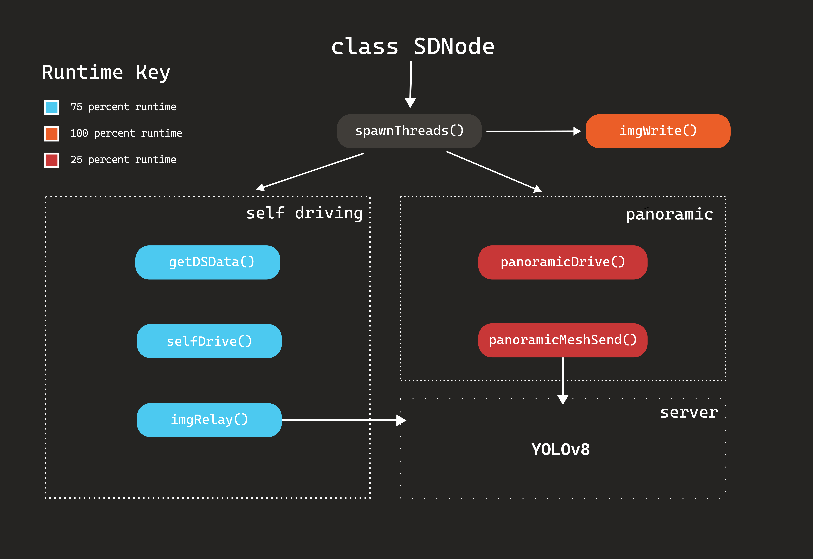

# [Project Website](https://crisis-vision.vercel.app/)

## Description

There are some situations such as natural disasters and war zones where it's critical for people to gather information about the surroundings. However, these environments can pose a risk to the safety of those involved. crisisvision is an autonomous surveillance vehicle designed to map out dangerous surroundings and detect various entities such as abandoned humans all while relaying the information so the client can make decisions from a safe distance.

## Requirements

The vehicle requires many python libraries to be installed.  
To install the dependencies for this project, run on the raspberry pi:  
`pip3 install -r requirements.txt --break-system-packages`

## Installation and Testing

To install our code, run `git clone <HTTPS URL>` in the terminal of your Raspberry Pi and on a Host Computer
First enter the pi folder on the host computer and run the server script using command `python3 server.py`
Then enter the pi folder on the Raspberry Pi and run the client script using command `python3 algo.py`

## What it Does

* The vehicle starts by assessing the situation by moving around the crisis area while avoiding any obstacles
* Simultaneously, it will provide a live feed of the area to another device for the operators to view the surroundings remotely.
* The live feed features annotation of key features such as humans and other objects using a YOLOv8 model
* After live surveying for a period of time, it will position itself and spin around to take pictures and stitch them together into a panoramic image.
* Once it spins a full circle, it will go back to moving around and showing live feed data

## How it Works

Our system using a two state autonomous system to survey the crisis data for various objects such as survivors and collect panoramic data of the scene. Our approach has been optimized to maximize the Raspberry Pi's performance by utilizing threads and lightweight image processing techniques. A general overview of the system is shown above.

## Challenges

1) **Crashes:** The Raspberry Pi often crashed when trying to log in. This was a result of the UIUC network's various security measures. We addressed this issue by using a phone hotspot network. 

2) **Integration:** Code integration and testing on Raspberry Pi. We got the server-client connection to stream video between Windows laptops, but when we tested it on the Raspberry Pi, we ran into issues that had to be debugged and resolved.

3) **Code optimization** The first working draft of the code did not output a very high frame rate, so opmizations had to be made to increase the frame rate for this to be able to be used in a real natural disaster event.

4) **Data Transmission** Encoding data between a remote host and the raspberry pi was a challenging experience due to Pickle's strict encoding schemes. Creating a reliable and fast way to transmit data between the embedded system and host computer was a large challenge that we enjoying working on.

## Accomplishments

* Created a vehicle that could effectively navigate unknown environments autonomously.
* Created a real time feed with **sub 20 millisecond** annotations using the YOLOv8 model.
* Optimized the code using threads and image processing techniques which allowed for the arducam to output a video that was at a respectable frame rate **(~5-10x faster FPS)**. 

## What We Learned

1) Version compatability is very important between server and client devices when using python sockets. This issue led to the second thing we learned.
2) Deleting and reinstalling python can create a lot of issues. We attempted to do that because of the version compatability, but it just caused more problems for our Raspberry Pi. 

## What's Next
Our vision for this product moving forward is to continue pushing the boundaries of the program's speed while maintaining reliability. We hope to integrate our system with mechanical components that can assist in moving hazardous debris and objects.

## Dependencies

* **Control System:** numpy, threading, time, sockets, struct
* **Computer Vision and Image Processing:** cv2, ultralytics, supervision, picamera2
* **Drivers:** Many thanks to [John Deere](https://github.com/jameskabbes/HackIllinois2024/tree/main)
